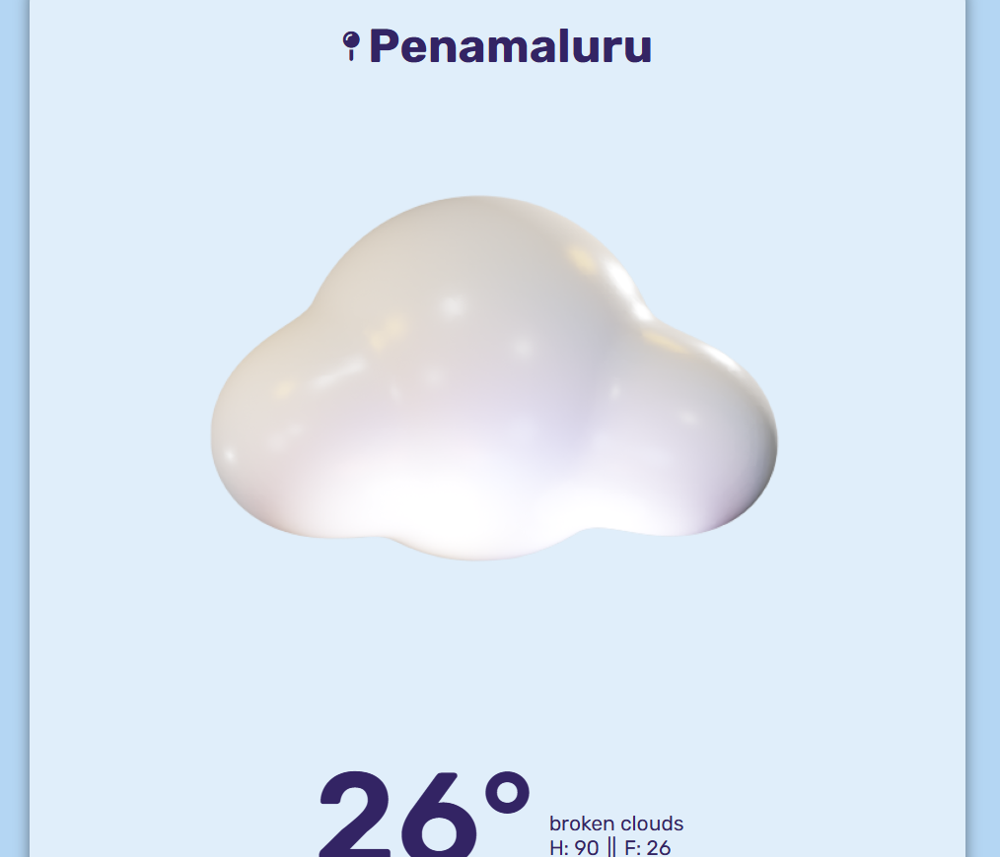

# 🌦️ Weather WebApp

A simple and beautiful **Weather App** built using **HTML, CSS, and JavaScript** that fetches real-time weather data using the **OpenWeatherMap API**.  
It displays live temperature, humidity, wind speed, and weather conditions for any city entered by the user.

---

## 🚀 Features

- 🌍 Search weather by city name  
- 🌡️ Displays temperature, humidity, and wind speed  
- 🕒 Real-time weather updates from OpenWeatherMap API  
- 🎨 Clean and responsive UI design  
- ⚡ Instant results with async JavaScript

---

## 🧩 Tech Stack

- **Frontend:** HTML, CSS, JavaScript  
- **API:** [OpenWeatherMap API](https://openweathermap.org/api)

---

## 📸 Screenshot



---

## 🧠 How It Works

1. User enters a city name.  
2. JavaScript calls the OpenWeatherMap API to fetch live weather data.  
3. The app dynamically displays the weather info on screen.

---

## 🛠️ Setup Instructions

1. Clone this repository:
   ```bash
   git clone https://github.com/Damayanthi19/weather-webapp.git
Open the folder in your code editor.

Replace YOUR_API_KEY in js/main.js with your actual key from OpenWeatherMap
.

Run index.html in your browser.
💡 Example

Search for any city, like London or Hyderabad, and instantly get:

Temperature 🌡️

Wind speed 💨

Humidity 💧

Condition (Sunny, Cloudy, Rainy, etc.)
👩‍💻 Author

Damayanthi Ravinuthala
🔗 LinkedIn


